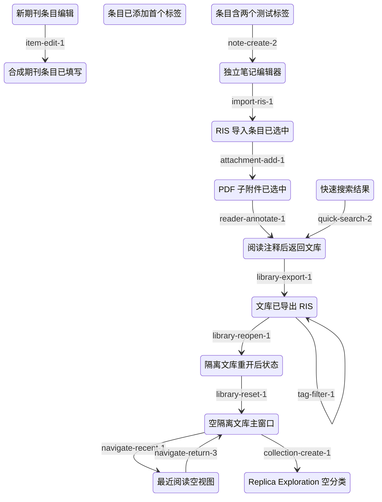

# UI 状态图

```mermaid
stateDiagram-v2
    state "空隔离文库主窗口" as s0
    state "最近阅读空视图" as s1
    state "Replica Exploration 空分类" as s2
    state "新期刊条目编辑" as s3
    state "合成期刊条目已填写" as s4
    state "条目已添加首个标签" as s5
    state "条目含两个测试标签" as s6
    state "独立笔记编辑器" as s7
    state "RIS 导入条目已选中" as s8
    state "PDF 子附件已选中" as s9
    state "阅读注释后返回文库" as s10
    state "快速搜索结果" as s11
    state "文库已导出 RIS" as s12
    state "隔离文库重开后状态" as s13
    s0 --> s1: navigate-recent-1
    s1 --> s0: navigate-return-3
    s0 --> s2: collection-create-1
    s3 --> s4: item-edit-1
    s6 --> s7: note-create-2
    s7 --> s8: import-ris-1
    s8 --> s9: attachment-add-1
    s9 --> s10: reader-annotate-1
    s11 --> s10: quick-search-2
    s10 --> s12: library-export-1
    s12 --> s12: preferences-review-1
    s12 --> s12: advanced-search-1
    s12 --> s12: duplicates-trash-1
    s12 --> s12: tag-filter-1
    s12 --> s13: library-reopen-1
    s13 --> s0: library-reset-1
```

完整控件、快照、转换和恢复路径见 [ui-states.json](ui-states.json)。
